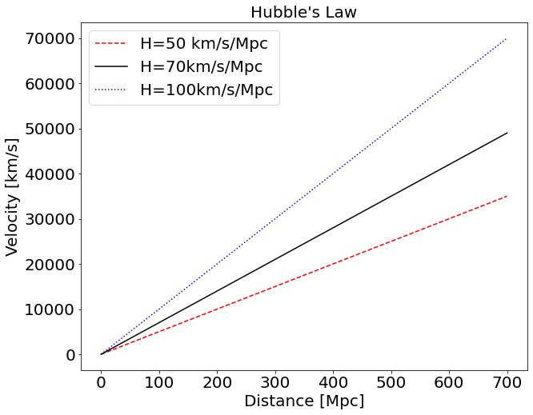
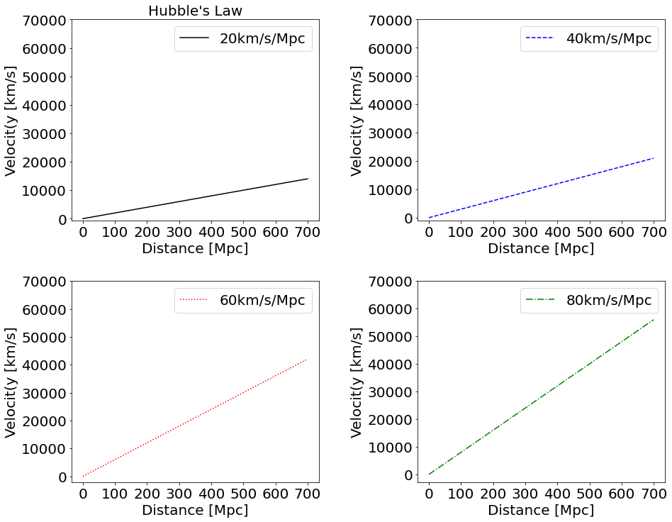
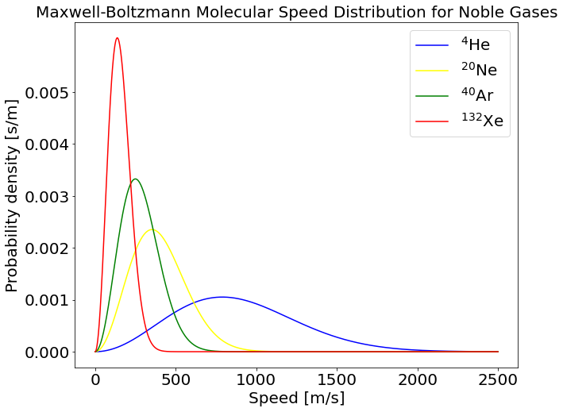

# 1. Hubble's Law 그래프 그리기

거리와 속력 데이터를 이용하여 허블 법칙의 그래프를 그려본다. 허블 상수는 50km/s/Mpc, 70km/s/Mpc, 100km/s/Mpc으로 하고 거리는 0~800Mpc으로 설정한다. 각각의 선들은 다른 형태와 다른 색을 가지도록 설정한다.


```python
import numpy as np
import matplotlib.pyplot as plt
```


```python
plt.figure(figsize=(10,8))
d_arr = np.arange(0,800,100)
H = [50,70,100]
line = ["--","-",":"]
label=["H=50 km/s/Mpc", "H=70km/s/Mpc", "H=100km/s/Mpc"]
color = ["red", "black", "blue"]

def func(d_arr, H):
    result = d_arr*H
    return result

for i in range(len(H)):
    flux=func(d_arr, H[i])
    plt.plot(d_arr, flux, line[i], color=color[i], label=label[i])
        
plt.xlabel(r"Distance [Mpc]", fontsize=20)
plt.ylabel(r"Velocity [km/s]", fontsize=20)
plt.xticks([0,100,200,300,400,500,600,700], fontsize=20)
plt.yticks([0,10000,20000,30000,40000,50000,60000,70000], fontsize=20)
plt.legend(fontsize=20)
plt.title("Hubble\'s Law", fontsize=20)
```


    Text(0.5, 1.0, "Hubble's Law")


    

    


# 2. subplot을 이용해 그래프 그리기

subplot을 이용하여 그래프를 생성한다. 단, 허블 상수에 따라 기울기가 달라지는 것을 나타내기 위해 각 그래프 선의 색상은 다르게 설정한다. 반복문을 활용하여 코드를 간단하게 하고, 각 허블상수를 그래프에 나타낸다.


```python
plt.figure(figsize=(15,12))
d_arr = np.arange(0,800,100)
n_H = [20,30,60,80]
n_line = ["-","--",":","-."]
n_label = ["20km/s/Mpc", "40km/s/Mpc", "60km/s/Mpc", "80km/s/Mpc"]
n_color = ["black", "blue", "red", "green"]


for i in range(len(n_H)):
    inow = "2"+"2"+str(i+1)
    plt.subplot(int(inow))
    flux = func(d_arr, n_H[i])
    plt.plot(d_arr, flux, n_line[i], color=n_color[i], label=n_label[i])
    plt.xlabel(r"Distance [Mpc]", fontsize=20)
    plt.ylabel(r"Velocit(y [km/s]", fontsize=20)
    plt.xticks([0,100,200,300,400,500,600,700], fontsize=20)
    plt.yticks([0,10000,20000,30000,40000,50000,60000,70000], fontsize=20)
    plt.legend(fontsize=20)
    if (i==0):
        plt.title("Hubble\'s Law", fontsize=20)

plt.subplots_adjust(hspace=0.3,wspace=0.4)
```


    

    


나타낸 그래프를 이미지로 저장하고 싶은 경우, **matplotlib.pyplot**의 **savefig**를 사용한다.

```python
plt.savefig("image.png")
```

# 3. Maxwell-Boltzman 분포 그리기

https://en.wikipedia.org/wiki/Maxwell%E2%80%93Boltzmann_distribution 에서 볼 수 있듯이 맥스웰-볼츠만 분포의 함수는 다음과 같다.

f(v) = (m/2*pi*kB*T)^(3/2)*(4*pi*v^2)*e^{-(mv^2)/(2*k*T)}

상수는 다음과 같이 정했을 때,
m(molecule mass) = 2*atomic mass*10^(-3)/{6.02*10^(23)} <br>
T = 300K <br>
kB(Boltzman constant) = 1.38*10^(-23) 

atomic mass에 대해서 맥스웰-볼츠만 분포를 그려본다.


```python
plt.figure(figsize=(10,8))
s_arr = np.arange(0,2501)
color = ["blue", "yellow", "green", "red"]
label = ["$^4$He", "$^{20}$Ne", "$^{40}$Ar", "$^{132}$Xe"]
atomic_mass= [4,20,40,132]
    
def func2(s_arr, m):
    kB=1.38e-23
    T=300
    result = ((m/(2*np.pi*kB*T))**(3/2))*4*np.pi*s_arr*s_arr
    result = result*np.exp(((-1)*m*s_arr*s_arr)/(2*kB*T))
    return result

for i in range(len(atomic_mass)): 
    m = (2*atomic_mass[i]*1e-3)/(6.02e23)
    flux = func2(s_arr, m)
    plt.plot(s_arr, flux, color=color[i], label=label[i])

plt.xlabel(r"Speed [m/s]", fontsize=20)
plt.ylabel(r"Probability density [s/m]", fontsize=20)
plt.xticks([0,500,1000,1500,2000,2500], fontsize=20)
plt.yticks([0.000,0.001,0.002,0.003,0.004,0.005], fontsize=20)
plt.legend(fontsize=20)
plt.title("Maxwell-Boltzmann Molecular Speed Distribution for Noble Gases", fontsize=20)
plt.savefig("Maswell-Boltzmann Molecular Speed Distribution for Noble Gases.png")
```


    

    

